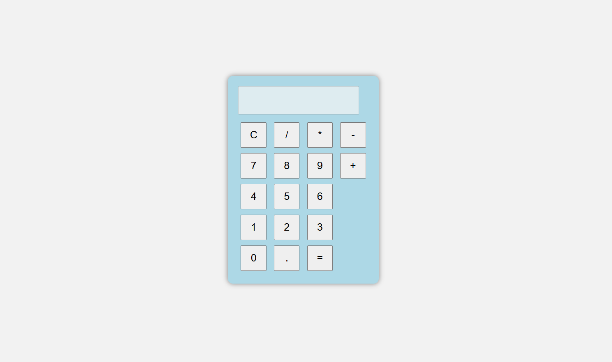

# Calculator App

A simple calculator built using HTML, CSS and JavaScript.

## Features
- Addition
- Subtraction
- Multiplication
- Division
- Responsive design

## Technologies Used
- HTML
- CSS
- JavaScript

## Live Demo
https://nithyasrimajji.github.io/calculator-app/

## Screenshot

